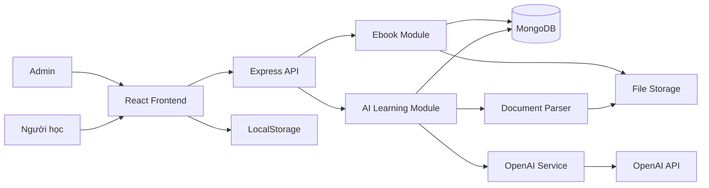

# 1. GIỚI THIỆU TỔNG QUAN

## 1.1. Tên tính năng

**AI Learning Map**

## 1.2. Đặt vấn đề

Giáo trình PDF hoặc EPUB thường có số lượng nội dung lớn, nhiều chương, nhiều chủ đề và nhiều phần kiến thức có mức độ quan trọng khác nhau.

Trong quá trình tự học, người học thường gặp các khó khăn:

1. Không nhìn thấy cấu trúc tổng quát của toàn bộ giáo trình.
2. Không biết nội dung nào là kiến thức trọng tâm.
3. Không biết nên học theo thứ tự nào.
4. Mất nhiều thời gian tự tóm tắt từng chương.
5. Đọc nhiều nhưng không ghi nhớ được kiến thức cốt lõi.
6. Không có phương tiện đơn giản để theo dõi phần đã học.

Ebook Reader hiện tại chủ yếu hỗ trợ đọc nội dung. Hệ thống chưa chuyển giáo trình thành một lộ trình học trực quan.

---

## 1.3. Mô tả bài toán

Hệ thống cần cho phép quản trị viên upload một giáo trình PDF hoặc EPUB.

Sau khi upload, AI thực hiện:

1. Phân tích cấu trúc giáo trình.
2. Nhận diện phần, chương, mục và chủ đề quan trọng.
3. Tạo sơ đồ kiến thức dạng cây.
4. Liên kết từng lesson node với nội dung nguồn.
5. Sinh bài học trọng tâm khi người học chọn node.
6. Lưu bài học đã sinh để tái sử dụng.

Người học có thể:

1. Xem toàn bộ sơ đồ giáo trình.
2. Mở hoặc thu gọn các nhánh.
3. Chọn một lesson node.
4. Đọc bài học trọng tâm.
5. Đánh dấu node đã hoàn thành.
6. Bỏ đánh dấu hoàn thành khi cần.

---

## 1.4. Mục tiêu

### Mục tiêu nghiệp vụ

Tạo một quy trình học đơn giản:

```text
Upload sách
→ Xem sơ đồ
→ Chọn node
→ Học nội dung trọng tâm
→ Đánh dấu hoàn thành
```

### Mục tiêu người dùng

Người học có thể:

* Hiểu cấu trúc tổng thể của giáo trình.
* Xác định các kiến thức cần học.
* Học theo thứ tự rõ ràng.
* Không phải tự tóm tắt từng phần.
* Theo dõi các phần đã hoàn thành.

### Mục tiêu kỹ thuật

* Tận dụng module Ebook hiện tại.
* Giữ nguyên React, Express và MongoDB.
* Không xây tài khoản người học trong MVP.
* Không sử dụng vector database.
* Không xây chatbot toàn sách.
* Cache bài học để giảm số lần gọi AI.
* Yêu cầu AI trả dữ liệu có cấu trúc.

---

## 1.5. Phạm vi hệ thống

### Trong phạm vi

* Upload PDF.
* Upload EPUB.
* Trích xuất nội dung giáo trình.
* Tạo knowledge map bằng AI.
* Hiển thị group node.
* Hiển thị lesson node.
* Sinh bài học khi chọn node.
* Lưu bài học trong MongoDB.
* Đánh dấu hoàn thành bằng LocalStorage.
* Tạo lại sơ đồ bởi admin.

### Ngoài phạm vi

* Chat tự do với toàn bộ sách.
* Quiz và chấm điểm.
* Flashcard.
* Spaced repetition.
* Lịch ôn tập.
* Voice tutor.
* Audio lesson.
* Tài khoản người học.
* Đồng bộ tiến độ đa thiết bị.
* Chia sẻ sơ đồ.
* Vector database.
* RAG.
* Fine-tuning.
* n8n workflow.

---

## 1.6. Đối tượng sử dụng

### Quản trị viên

Quản trị viên có thể:

* Upload giáo trình.
* Tạo sơ đồ kiến thức.
* Theo dõi trạng thái xử lý.
* Tạo lại sơ đồ.
* Xóa hoặc thay thế giáo trình.

### Người học

Người học không cần đăng nhập.

Người học có thể:

* Xem sơ đồ.
* Chọn lesson node.
* Xem bài học.
* Đánh dấu hoàn thành.
* Bỏ đánh dấu hoàn thành.

Tiến độ hoàn thành chỉ được lưu trên trình duyệt hiện tại.

---

## 1.7. Định hướng giải quyết

### Bước 1 — Trích xuất nội dung

Backend xác định định dạng file và trích xuất nội dung.

Cấu trúc dữ liệu chuẩn hóa:

```json
{
  "title": "Tên giáo trình",
  "fileType": "pdf",
  "sections": [
    {
      "title": "Chương 1",
      "pageStart": 1,
      "pageEnd": 20,
      "content": "Nội dung chương..."
    }
  ]
}
```

Đối với PDF, hệ thống lưu số trang.

Đối với EPUB, hệ thống lưu chương, mục lục và thứ tự nội dung.

### Bước 2 — Tạo sơ đồ kiến thức

AI phân tích nội dung và trả về cây kiến thức.

```json
{
  "nodes": [
    {
      "tempId": "chapter-1",
      "parentTempId": null,
      "title": "Chương 1",
      "nodeType": "group",
      "orderIndex": 1
    },
    {
      "tempId": "lesson-1",
      "parentTempId": "chapter-1",
      "title": "Chi phí cơ hội",
      "nodeType": "lesson",
      "orderIndex": 1,
      "pageStart": 10,
      "pageEnd": 15
    }
  ]
}
```

### Bước 3 — Sinh bài học

Khi người học chọn lesson node:

```text
Tìm node
→ Kiểm tra lesson cache
→ Lấy nội dung nguồn
→ Gọi AI nếu chưa có lesson
→ Validate output
→ Lưu MongoDB
→ Render bài học
```

### Bước 4 — Đánh dấu hoàn thành

Danh sách node hoàn thành được lưu bằng LocalStorage.

```json
{
  "completedNodeIds": [
    "node-id-1",
    "node-id-2"
  ]
}
```

---

## 1.8. Cơ sở lý thuyết

### Phân rã nội dung phân cấp

Giáo trình được biểu diễn dưới dạng cây:

```text
Giáo trình
├── Phần
│   ├── Chương
│   │   ├── Chủ đề
│   │   └── Chủ đề
│   └── Chương
└── Phần
```

Cấu trúc cây giúp:

* Quan sát toàn bộ nội dung.
* Giữ quan hệ cha – con.
* Giữ thứ tự học.
* Giới hạn phạm vi của từng bài học.

### Grounded Generation

Bài học phải được sinh dựa trên nội dung nguồn của node.

Quy tắc:

* Không dùng kiến thức sẵn có của model làm nguồn chính.
* Không tự thêm số liệu hoặc kết luận.
* Ví dụ do AI tạo phải được gắn nhãn.
* Nếu nguồn không đủ, hệ thống phải thông báo rõ.

### Xác định trọng tâm

Một nội dung được xem là bắt buộc khi thuộc một trong các nhóm:

* Định nghĩa chính.
* Khái niệm chính.
* Nguyên lý.
* Quy tắc.
* Công thức.
* Điều kiện áp dụng.
* Ngoại lệ quan trọng.
* Kết luận cần thiết cho phần tiếp theo.

### Lazy Generation

Bài học chỉ được sinh khi lesson node được mở lần đầu.

Lợi ích:

* Giảm chi phí AI.
* Giảm thời gian upload.
* Không sinh nội dung không được sử dụng.
* Dễ thay đổi prompt cho các node chưa được sinh.

### Caching

Sau lần sinh đầu tiên, bài học được lưu trong MongoDB.

```text
Lần đầu:
Node → AI → MongoDB → Frontend

Lần sau:
Node → MongoDB → Frontend
```

### Structured Output

AI phải trả về JSON theo schema cố định.

Điều này giúp:

* Validate output.
* Render giao diện ổn định.
* Tránh lỗi parse Markdown.
* Dễ lưu dữ liệu.
* Dễ thay đổi model AI.

---

## 1.9. Công nghệ sử dụng

| Thành phần         | Công nghệ            |
| ------------------ | -------------------- |
| Frontend           | React, Vite          |
| Giao diện          | Tailwind CSS         |
| Client state       | Zustand              |
| Server state       | TanStack Query       |
| Routing            | React Router         |
| PDF Reader         | PDF.js               |
| EPUB Reader        | EPUB.js              |
| Backend            | Node.js, Express     |
| Database           | MongoDB, Mongoose    |
| Xác thực admin     | JWT                  |
| AI                 | OpenAI Responses API |
| Tiến độ hoàn thành | LocalStorage         |

### Biến môi trường AI

```env
OPENAI_API_KEY=
OPENAI_MAP_MODEL=
OPENAI_LESSON_MODEL=
```

Tên model không được hard-code trong source code.

---

## 1.10. Kiến trúc tổng quát



---

## 1.11. Tiêu chí thành công

MVP được xem là thành công khi:

1. Admin upload được PDF hoặc EPUB.
2. Hệ thống tạo được sơ đồ kiến thức.
3. Sơ đồ có group node và lesson node.
4. Lesson node liên kết với đúng nội dung nguồn.
5. Người học chọn node và xem được bài học.
6. Bài học được cache sau lần sinh đầu tiên.
7. Người học đánh dấu hoàn thành.
8. Trạng thái hoàn thành còn tồn tại sau khi reload.
