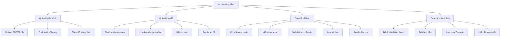
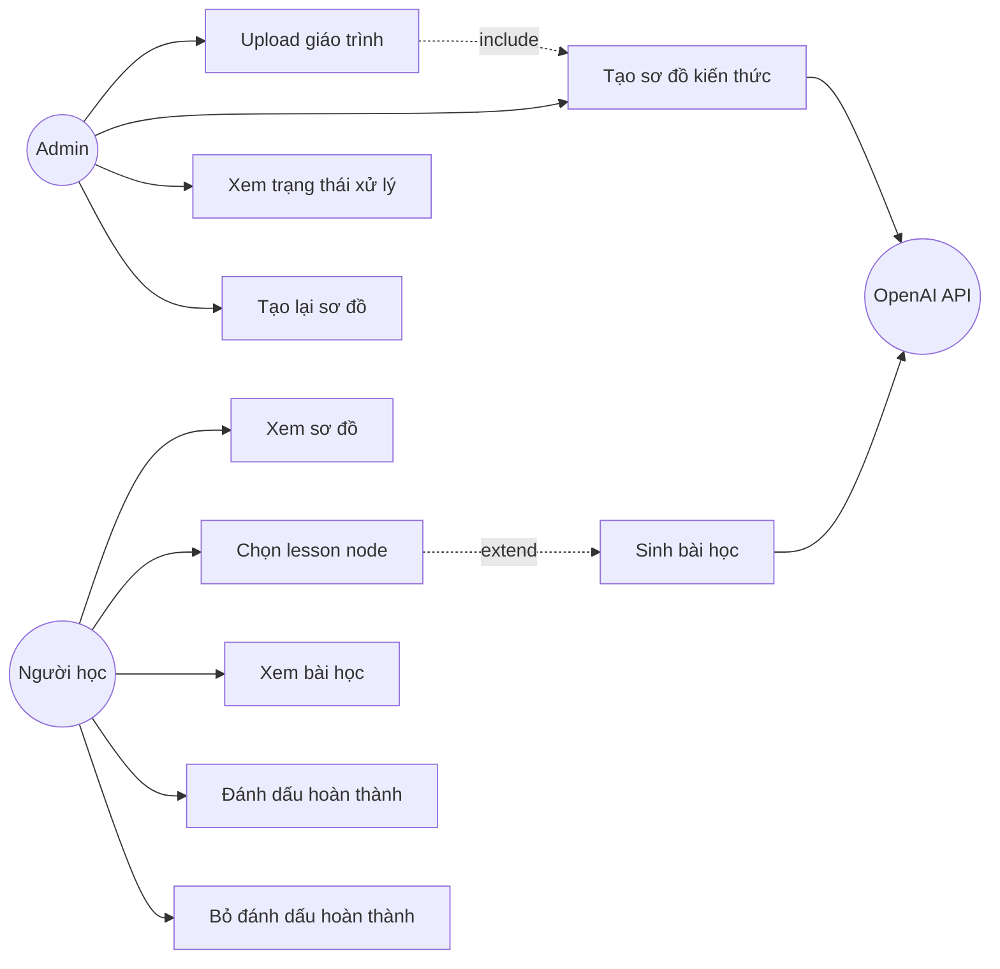
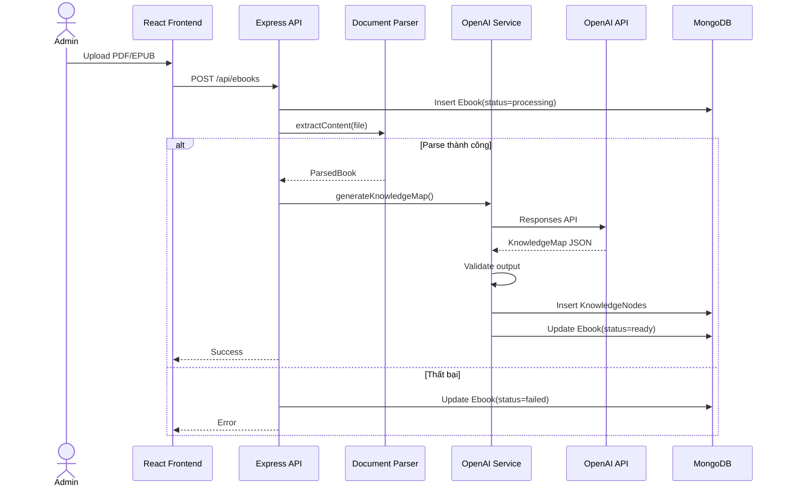
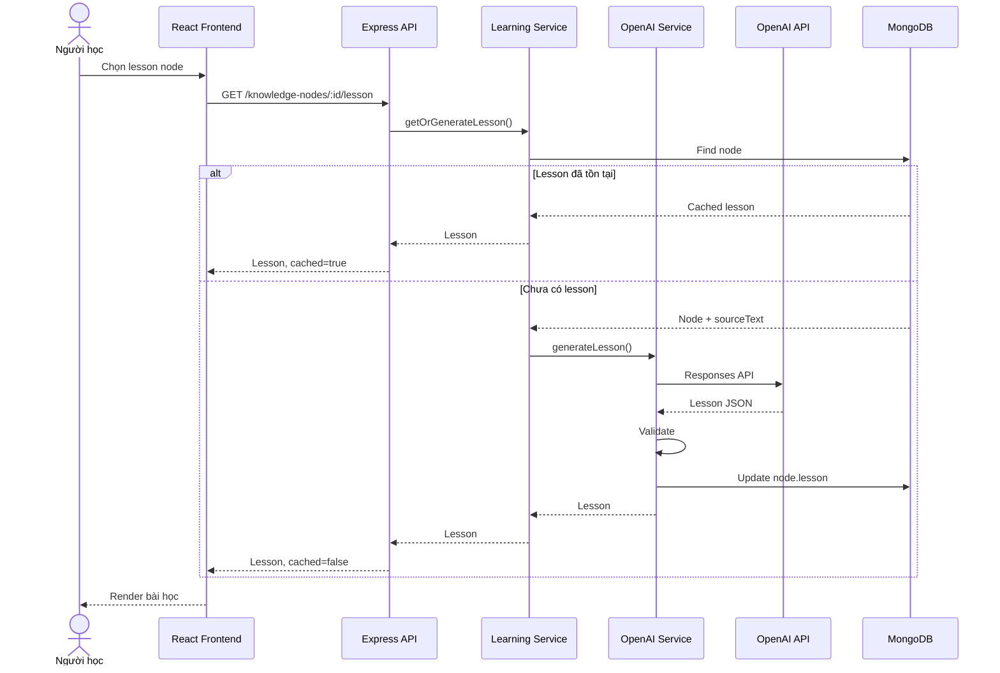
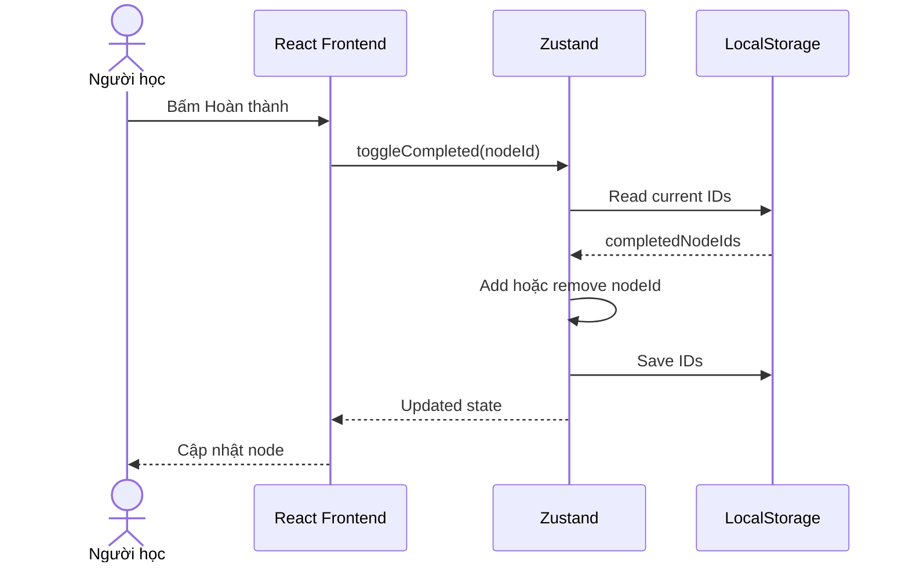
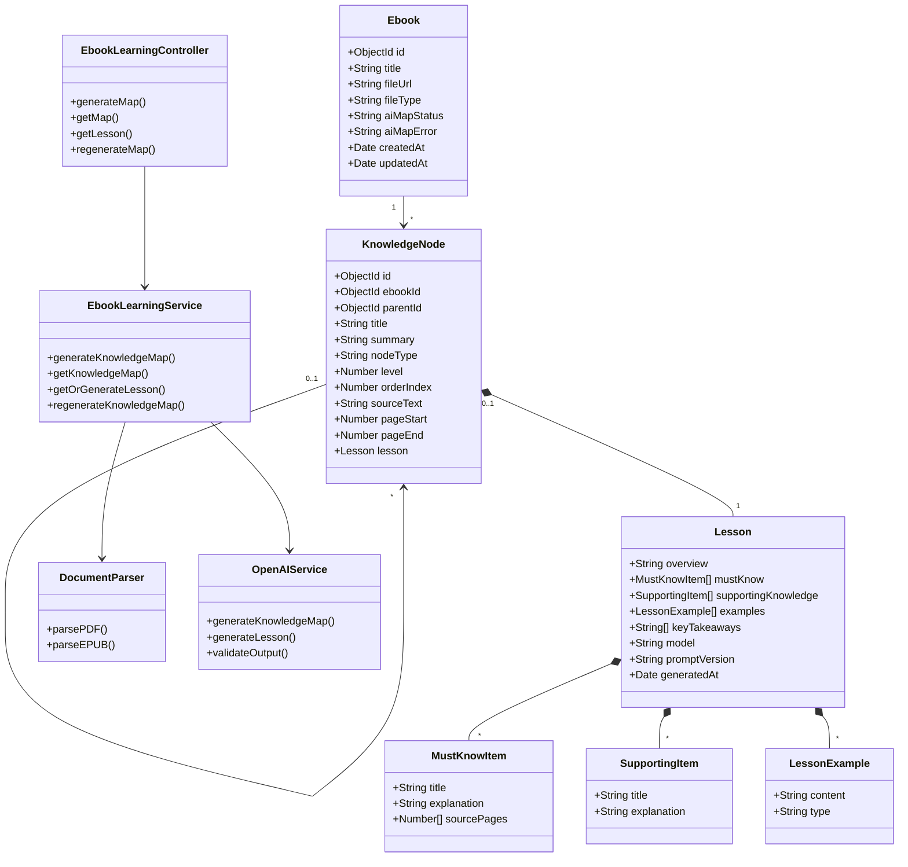

# 2. PHÂN TÍCH VÀ THIẾT KẾ HỆ THỐNG

## 2.1. Actor

### Admin

* Upload giáo trình.
* Tạo sơ đồ kiến thức.
* Xem trạng thái xử lý.
* Tạo lại sơ đồ.
* Xóa giáo trình.

### Người học

* Xem sơ đồ.
* Chọn lesson node.
* Xem bài học.
* Đánh dấu hoàn thành.
* Bỏ đánh dấu hoàn thành.

### OpenAI API

* Phân tích giáo trình.
* Tạo knowledge map.
* Sinh nội dung bài học.

---

# 3. PHÂN TÍCH CHỨC NĂNG

## 3.1. Danh sách chức năng

| Mã   | Chức năng              | Actor     |
| ---- | ---------------------- | --------- |
| F-01 | Upload giáo trình      | Admin     |
| F-02 | Trích xuất nội dung    | Hệ thống  |
| F-03 | Tạo sơ đồ kiến thức    | Hệ thống  |
| F-04 | Xem trạng thái xử lý   | Admin     |
| F-05 | Tạo lại sơ đồ          | Admin     |
| F-06 | Xem sơ đồ kiến thức    | Người học |
| F-07 | Chọn lesson node       | Người học |
| F-08 | Sinh bài học           | Hệ thống  |
| F-09 | Xem bài học            | Người học |
| F-10 | Đánh dấu hoàn thành    | Người học |
| F-11 | Bỏ đánh dấu hoàn thành | Người học |
| F-12 | Tải bài học từ cache   | Hệ thống  |

## 3.2. Phân rã chức năng



---

## 3.3. Yêu cầu chức năng

### FR-01 — Upload giáo trình

Hệ thống hỗ trợ:

* PDF.
* EPUB.

Thông tin tối thiểu:

* Tên sách.
* File.
* Ảnh bìa nếu có.
* Mô tả nếu có.

### FR-02 — Xử lý giáo trình

Sau khi upload:

1. Tạo Ebook.
2. Đặt trạng thái `processing`.
3. Trích xuất nội dung.
4. Gọi AI tạo sơ đồ.
5. Lưu node.
6. Đặt trạng thái `ready`.

Nếu thất bại, trạng thái là `failed`.

### FR-03 — Tạo knowledge map

Mỗi node gồm:

* ID.
* Parent ID.
* Title.
* Summary.
* Node type.
* Level.
* Order index.
* Phạm vi nguồn.

Lesson node có thêm:

* Source text.
* Page start.
* Page end.
* Source chapter ID nếu là EPUB.

### FR-04 — Hiển thị sơ đồ

Giao diện phải:

* Hiển thị đúng quan hệ cha – con.
* Hiển thị đúng thứ tự.
* Cho phép thu gọn và mở rộng.
* Phân biệt group node và lesson node.
* Highlight node đang chọn.
* Hiển thị node đã hoàn thành.

### FR-05 — Sinh bài học

Khi lesson node được chọn:

1. Kiểm tra cache.
2. Nếu có lesson, trả dữ liệu đã lưu.
3. Nếu chưa có, lấy source.
4. Gọi AI.
5. Validate output.
6. Lưu MongoDB.
7. Trả lesson về frontend.

### FR-06 — Nội dung lesson

Lesson gồm:

```json
{
  "overview": "string",
  "mustKnow": [],
  "supportingKnowledge": [],
  "examples": [],
  "keyTakeaways": []
}
```

### FR-07 — Hoàn thành node

* Chỉ lesson node được hoàn thành.
* Group node không có nút hoàn thành.
* Trạng thái được lưu tại LocalStorage.

---

## 3.4. Business Rules

| Mã    | Quy tắc                                    |
| ----- | ------------------------------------------ |
| BR-01 | Chỉ admin được upload giáo trình           |
| BR-02 | Chỉ admin được tạo hoặc tạo lại map        |
| BR-03 | Người học không cần đăng nhập              |
| BR-04 | Chỉ lesson node được hoàn thành            |
| BR-05 | Group node chỉ dùng để tổ chức             |
| BR-06 | Lesson node phải có nguồn                  |
| BR-07 | AI sử dụng nội dung node làm nguồn chính   |
| BR-08 | Ví dụ AI tạo phải được gắn nhãn            |
| BR-09 | Không gọi AI khi lesson đã có cache        |
| BR-10 | Output AI phải được validate               |
| BR-11 | Retry tối đa hai lần                       |
| BR-12 | Không lưu output sai schema                |
| BR-13 | Không trả sourceText trong API map public  |
| BR-14 | Tạo lại map xóa node và lesson cũ          |
| BR-15 | Tiến độ chỉ tồn tại trên thiết bị hiện tại |

---

# 4. USE CASE

## 4.1. Use Case Diagram



## 4.2. UC-01 — Upload và tạo sơ đồ

| Thuộc tính     | Nội dung                            |
| -------------- | ----------------------------------- |
| Actor          | Admin                               |
| Mục tiêu       | Tải giáo trình và tạo knowledge map |
| Tiền điều kiện | Admin đăng nhập, file hợp lệ        |
| Hậu điều kiện  | Ebook và knowledge nodes được lưu   |

### Luồng chính

1. Admin mở trang quản lý ebook.
2. Admin chọn file.
3. Admin nhập metadata.
4. Admin upload.
5. Hệ thống validate file.
6. Hệ thống lưu Ebook.
7. Hệ thống đặt trạng thái `processing`.
8. Hệ thống parse nội dung.
9. Hệ thống gọi AI.
10. AI trả knowledge map.
11. Hệ thống validate.
12. Hệ thống lưu node.
13. Hệ thống đặt trạng thái `ready`.

### Luồng lỗi

* File không hợp lệ: từ chối upload.
* Không parse được: trạng thái `failed`.
* AI lỗi: retry tối đa hai lần.
* JSON sai schema: không lưu node.

## 4.3. UC-02 — Xem sơ đồ

1. Người học mở ebook.
2. Chọn tab “Sơ đồ học”.
3. Frontend gọi API map.
4. Backend trả danh sách node.
5. Frontend đọc LocalStorage.
6. Frontend render tree và trạng thái hoàn thành.

## 4.4. UC-03 — Xem bài học

1. Người học chọn lesson node.
2. Frontend gọi API lesson.
3. Backend tìm node.
4. Backend kiểm tra lesson.
5. Nếu đã có, trả cache.
6. Nếu chưa có, gọi AI.
7. Validate bài học.
8. Lưu bài học.
9. Trả dữ liệu cho frontend.

## 4.5. UC-04 — Hoàn thành node

1. Người học bấm “Hoàn thành”.
2. Frontend thêm node ID vào LocalStorage.
3. Zustand cập nhật state.
4. Sơ đồ hiển thị node đã hoàn thành.

---

# 5. SEQUENCE DIAGRAM

## 5.1. Upload và tạo sơ đồ



## 5.2. Chọn node và sinh lesson



## 5.3. Hoàn thành node



---

# 6. CLASS DIAGRAM



---

# 7. DATA MODEL

## 7.1. Ebook

```js
{
  title: String,
  fileUrl: String,
  fileType: "pdf" | "epub",

  aiMapStatus:
    "none" |
    "processing" |
    "ready" |
    "failed",

  aiMapError: String | null
}
```

## 7.2. KnowledgeNode

```js
{
  ebookId: ObjectId,
  parentId: ObjectId | null,

  title: String,
  summary: String,

  nodeType: "group" | "lesson",

  level: Number,
  orderIndex: Number,

  sourceText: String,
  pageStart: Number | null,
  pageEnd: Number | null,
  sourceChapterId: String | null,

  lesson: {
    overview: String,

    mustKnow: [
      {
        title: String,
        explanation: String,
        sourcePages: [Number]
      }
    ],

    supportingKnowledge: [
      {
        title: String,
        explanation: String
      }
    ],

    examples: [
      {
        content: String,
        type: "BOOK" | "AI_GENERATED"
      }
    ],

    keyTakeaways: [String],

    model: String,
    promptVersion: String,
    generatedAt: Date
  }
}
```

## 7.3. LocalStorage

Key:

```text
meomeo-learning-map:<ebookId>
```

Value:

```json
{
  "version": 1,
  "completedNodeIds": [
    "node-id-1",
    "node-id-2"
  ]
}
```

---

# 8. API DESIGN

| Method | Endpoint                                       | Quyền  | Mục đích             |
| ------ | ---------------------------------------------- | ------ | -------------------- |
| POST   | `/api/ebooks/:ebookId/learning-map`            | Admin  | Tạo map              |
| GET    | `/api/ebooks/:ebookId/learning-map`            | Public | Lấy map              |
| GET    | `/api/ebooks/:ebookId/learning-map/status`     | Public | Lấy trạng thái       |
| POST   | `/api/ebooks/:ebookId/learning-map/regenerate` | Admin  | Tạo lại map          |
| GET    | `/api/knowledge-nodes/:nodeId/lesson`          | Public | Lấy hoặc sinh lesson |

## Response map

```json
{
  "ebookId": "ebook-id",
  "status": "ready",
  "nodes": [
    {
      "id": "node-id",
      "parentId": null,
      "title": "Chương 1",
      "summary": "Mô tả",
      "nodeType": "group",
      "level": 1,
      "orderIndex": 1,
      "pageStart": 1,
      "pageEnd": 20,
      "hasLesson": false
    }
  ]
}
```

## Response lesson

```json
{
  "node": {
    "id": "node-id",
    "title": "Chi phí cơ hội",
    "pageStart": 10,
    "pageEnd": 15
  },
  "lesson": {
    "overview": "Phần này trình bày...",
    "mustKnow": [],
    "supportingKnowledge": [],
    "examples": [],
    "keyTakeaways": []
  },
  "cached": true
}
```

---

# 9. CẤU TRÚC SOURCE CODE ĐỀ XUẤT

## Backend

```text
server/src/modules/ebook-learning/
├── ebook-learning.controller.js
├── ebook-learning.routes.js
├── ebook-learning.service.js
├── knowledge-node.model.js
├── document-parser.service.js
├── openai.service.js
├── schemas/
│   ├── knowledge-map.schema.js
│   └── lesson.schema.js
└── prompts/
    ├── knowledge-map.prompt.js
    └── lesson.prompt.js
```

## Frontend

```text
client/src/features/ebooks/
├── components/
│   ├── LearningMap/
│   │   ├── LearningMap.jsx
│   │   ├── LearningTreeNode.jsx
│   │   └── LearningMapStatus.jsx
│   └── NodeLesson/
│       ├── NodeLesson.jsx
│       ├── MustKnowSection.jsx
│       └── CompletionButton.jsx
├── hooks/
│   ├── useLearningMap.js
│   ├── useNodeLesson.js
│   └── useCompletedNodes.js
├── api/
│   └── ebookLearningApi.js
└── store/
    └── learningMapStore.js
```

::: 
