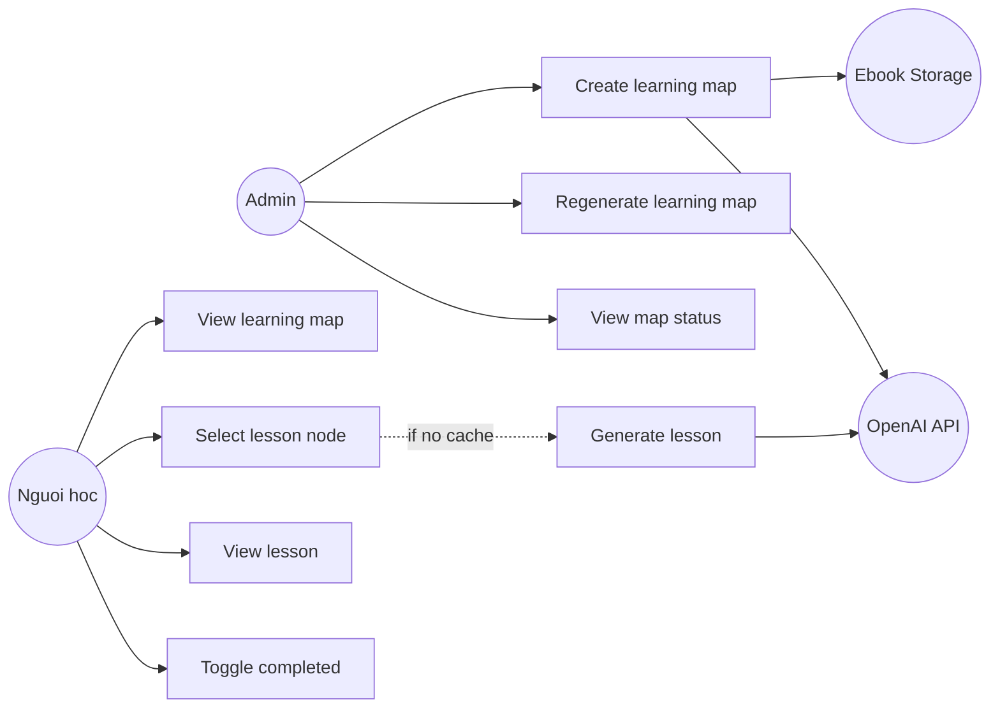
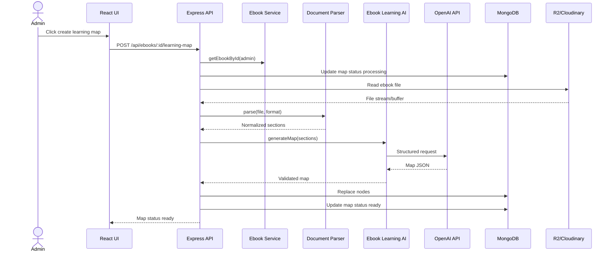
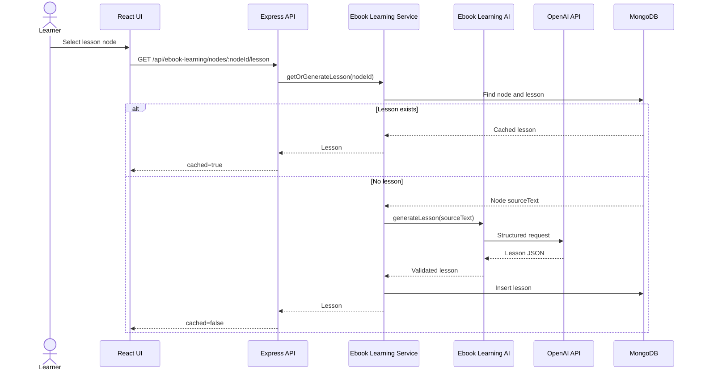
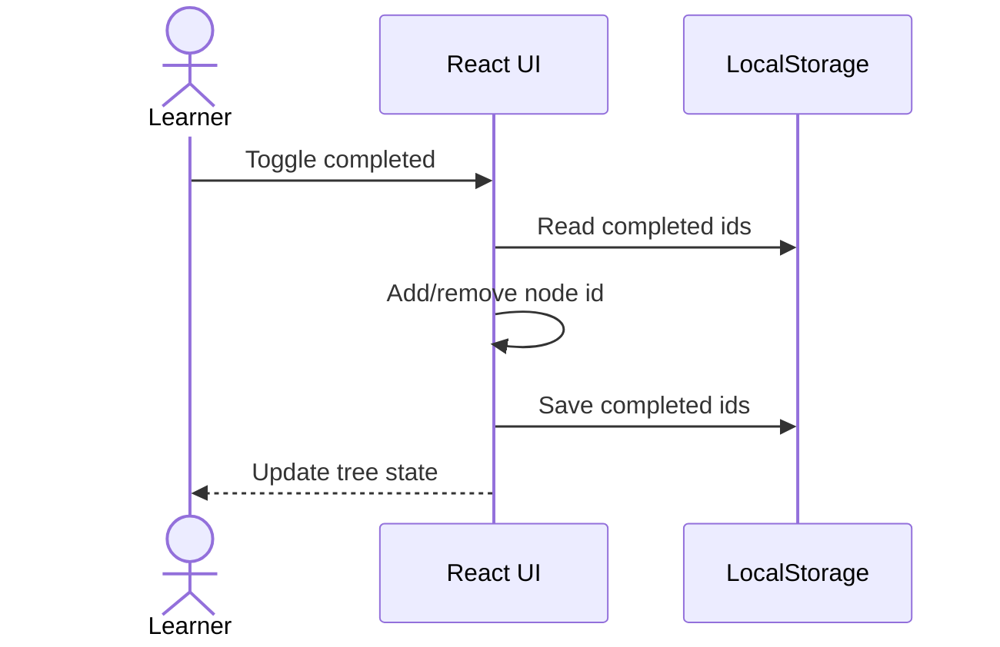

# 2. PHÂN TÍCH VÀ THIẾT KẾ HỆ THỐNG

## 2.1. Actor

### Admin

* Upload và publish ebook bằng module hiện có.
* Tạo AI Learning Map.
* Xem trạng thái xử lý map.
* Tạo lại map.

### Người học

* Đọc ebook public.
* Xem Learning Map.
* Chọn lesson node.
* Xem bài học trọng tâm.
* Đánh dấu hoàn thành.

### OpenAI API

* Tạo knowledge map từ nội dung sách đã parse.
* Sinh lesson từ source text của node.

### Storage

* R2 hoặc Cloudinary chứa file ebook.
* Parser đọc file từ storage thông qua service hiện có.

---

# 3. PHÂN TÍCH CHỨC NĂNG

## 3.1. Danh sách chức năng

| Mã | Chức năng | Actor |
| --- | --- | --- |
| F-01 | Tạo learning map cho ebook | Admin |
| F-02 | Parse PDF/EPUB từ file đã upload | Hệ thống |
| F-03 | Tạo cây kiến thức bằng AI | Hệ thống |
| F-04 | Xem trạng thái map | Admin/Người học |
| F-05 | Tạo lại map | Admin |
| F-06 | Xem learning map trong reader | Người học |
| F-07 | Chọn lesson node | Người học |
| F-08 | Sinh lesson khi chưa có cache | Hệ thống |
| F-09 | Trả lesson từ cache | Hệ thống |
| F-10 | Đánh dấu hoàn thành node | Người học |
| F-11 | Bỏ đánh dấu hoàn thành node | Người học |

## 3.2. Phân rã chức năng

```mermaid
flowchart TD
    A["AI Learning Map"]

    A --> B["Admin map lifecycle"]
    A --> C["Document processing"]
    A --> D["Map rendering"]
    A --> E["Lesson generation"]
    A --> F["Completion state"]

    B --> B1["Create map"]
    B --> B2["Check status"]
    B --> B3["Regenerate map"]

    C --> C1["Read ebook metadata"]
    C --> C2["Load file from storage"]
    C --> C3["Parse PDF/EPUB"]
    C --> C4["Normalize sections"]

    D --> D1["Fetch public map"]
    D --> D2["Render tree"]
    D --> D3["Expand/collapse"]
    D --> D4["Highlight active node"]

    E --> E1["Check lesson cache"]
    E --> E2["Load source text"]
    E --> E3["Generate lesson by AI"]
    E --> E4["Validate and save"]

    F --> F1["Toggle completed"]
    F --> F2["Save LocalStorage"]
```



## 3.3. Yêu cầu chức năng

### FR-01 — Tạo learning map

* Chỉ admin được tạo map.
* Ebook phải tồn tại.
* Ebook phải có `format` là `pdf` hoặc `epub`.
* Có thể tạo map cho ebook chưa publish, nhưng public chỉ xem được khi ebook publish.

### FR-02 — Trạng thái map

Trạng thái đề xuất:

```text
none | queued | processing | ready | failed
```

Trạng thái có thể lưu trực tiếp trên `Ebook` để UI list ebook hiển thị nhanh:

```js
learningMapStatus: String,
learningMapError: String,
learningMapGeneratedAt: Date
```

Nếu muốn tách lịch sử job, dùng thêm `EbookLearningJob`.

### FR-03 — Parse document

* PDF: trích xuất text theo page, gom thành section/chapter nếu có heading rõ.
* EPUB: đọc spine/toc, trích xuất text theo chapter.
* Nội dung quá dài phải chunk theo giới hạn env.
* Parser trả về `sections` có order ổn định.

### FR-04 — Tạo knowledge map

Mỗi node gồm:

* `ebookId`
* `parentId`
* `title`
* `summary`
* `nodeType`: `group` hoặc `lesson`
* `level`
* `orderIndex`
* source range nội bộ

Lesson node phải có source reference để sinh lesson.

### FR-05 — Hiển thị map

Giao diện trong Ebook Reader phải:

* Dùng panel/tab không phá layout reader hiện tại.
* Hiển thị đúng quan hệ cha-con.
* Cho phép expand/collapse.
* Phân biệt group và lesson node.
* Highlight node đang chọn.
* Hiển thị trạng thái hoàn thành từ LocalStorage.

### FR-06 — Sinh lesson

Khi người học chọn lesson node:

1. Backend kiểm tra `EbookLearningLesson`.
2. Nếu có lesson, trả cache.
3. Nếu chưa có, lấy `sourceText` của node.
4. Gọi AI với prompt grounded.
5. Validate output.
6. Lưu lesson.
7. Trả lesson public.

### FR-07 — Nội dung lesson

```json
{
  "overview": "string",
  "mustKnow": [
    {
      "title": "string",
      "explanation": "string",
      "sourceRefs": ["string"]
    }
  ],
  "supportingKnowledge": [],
  "examples": [
    {
      "content": "string",
      "type": "BOOK"
    }
  ],
  "keyTakeaways": []
}
```

### FR-08 — Hoàn thành node

* Chỉ lesson node được đánh dấu hoàn thành.
* MVP lưu bằng LocalStorage.
* Không đồng bộ server trong giai đoạn đầu.

## 3.4. Business Rules

| Mã | Quy tắc |
| --- | --- |
| BR-01 | Chỉ admin được tạo hoặc tạo lại map. |
| BR-02 | Người học không cần đăng nhập. |
| BR-03 | Public map chỉ trả dữ liệu cho ebook đã publish, trừ khi request có admin token. |
| BR-04 | Không trả `sourceText` trong public map API. |
| BR-05 | Group node chỉ dùng để tổ chức, không sinh lesson. |
| BR-06 | Lesson node phải có source reference. |
| BR-07 | AI lesson phải dựa trên source text của node. |
| BR-08 | Ví dụ do AI tự tạo phải có `type = "AI_GENERATED"`. |
| BR-09 | Không gọi AI nếu lesson đã có cache. |
| BR-10 | Output AI phải validate trước khi lưu. |
| BR-11 | Tạo lại map phải xóa hoặc archive nodes/lessons cũ trong cùng transaction logic. |
| BR-12 | Nếu parse hoặc AI failed, giữ ebook vẫn đọc được như cũ. |
| BR-13 | Hoàn thành node chỉ tồn tại trên thiết bị hiện tại trong MVP. |

---

# 4. USE CASE

## 4.1. Use Case Diagram



## 4.2. UC-01 — Tạo learning map

| Thuộc tính | Nội dung |
| --- | --- |
| Actor | Admin |
| Mục tiêu | Tạo sơ đồ học cho ebook đã upload |
| Tiền điều kiện | Admin đăng nhập, ebook tồn tại |
| Hậu điều kiện | Nodes được lưu, trạng thái map là `ready` hoặc `failed` |

### Luồng chính

1. Admin mở trang quản lý ebook hoặc reader.
2. Admin bấm "Tạo Learning Map".
3. Frontend gọi `POST /api/ebooks/:ebookId/learning-map`.
4. Backend kiểm tra quyền admin và ebook.
5. Backend đặt trạng thái `processing`.
6. Backend đọc file ebook từ storage.
7. Backend parse PDF/EPUB thành sections.
8. Backend gọi AI tạo map.
9. Backend validate JSON.
10. Backend lưu `EbookLearningNode`.
11. Backend cập nhật trạng thái `ready`.
12. UI hiển thị map.

### Luồng lỗi

* Ebook không tồn tại: 404.
* Không phải admin: 403.
* Không đọc được file: trạng thái `failed`.
* Parser không lấy được nội dung đủ dùng: trạng thái `failed`.
* AI output sai schema: retry theo cấu hình, sau đó `failed`.

## 4.3. UC-02 — Xem learning map

1. Người học mở ebook.
2. Người học mở panel/tab Learning Map.
3. Frontend gọi `GET /api/ebooks/:ebookId/learning-map`.
4. Backend kiểm tra ebook publish hoặc admin token.
5. Backend trả nodes không chứa `sourceText`.
6. Frontend đọc LocalStorage completion.
7. Frontend render tree.

## 4.4. UC-03 — Xem lesson

1. Người học chọn lesson node.
2. Frontend gọi `GET /api/ebook-learning/nodes/:nodeId/lesson`.
3. Backend kiểm tra node và quyền đọc ebook.
4. Backend kiểm tra lesson cache.
5. Nếu có cache, trả lesson.
6. Nếu chưa có, gọi AI sinh lesson từ source text.
7. Backend validate và lưu lesson.
8. Frontend render lesson.

## 4.5. UC-04 — Tạo lại map

1. Admin bấm "Tạo lại map".
2. Frontend gọi `POST /api/ebooks/:ebookId/learning-map/regenerate`.
3. Backend đặt trạng thái `processing`.
4. Backend xóa hoặc archive nodes/lessons cũ.
5. Backend parse file và gọi AI.
6. Backend lưu map mới.
7. Backend đặt trạng thái `ready`.

## 4.6. UC-05 — Hoàn thành node

1. Người học bấm hoàn thành.
2. Frontend thêm node id vào LocalStorage.
3. UI cập nhật trạng thái node.
4. Khi reload, frontend đọc lại LocalStorage.

---

# 5. SEQUENCE DIAGRAM

## 5.1. Tạo map



## 5.2. Chọn node và sinh lesson



## 5.3. Hoàn thành node



---

# 6. DATA MODEL

## 6.1. Ebook extension

Thêm field vào `Ebook` để list page và reader biết trạng thái map nhanh:

```js
{
  learningMapStatus: {
    type: String,
    enum: ["none", "queued", "processing", "ready", "failed"],
    default: "none"
  },
  learningMapError: String,
  learningMapGeneratedAt: Date,
  learningMapPromptVersion: String,
  learningMapModel: String
}
```

## 6.2. EbookLearningNode

```js
{
  ebookId: ObjectId,
  parentId: ObjectId | null,
  title: String,
  summary: String,
  nodeType: "group" | "lesson",
  level: Number,
  orderIndex: Number,
  path: String,

  sourceText: String,
  sourceSectionIndexes: [Number],
  pageStart: Number | null,
  pageEnd: Number | null,
  epubHref: String,
  epubCfi: String,

  hasLesson: Boolean,
  mapVersion: Number
}
```

Indexes:

```js
{ ebookId: 1, parentId: 1, orderIndex: 1 }
{ ebookId: 1, mapVersion: 1 }
```

## 6.3. EbookLearningLesson

```js
{
  ebookId: ObjectId,
  nodeId: ObjectId,
  overview: String,
  mustKnow: [
    {
      title: String,
      explanation: String,
      sourceRefs: [String]
    }
  ],
  supportingKnowledge: [
    {
      title: String,
      explanation: String
    }
  ],
  examples: [
    {
      content: String,
      type: "BOOK" | "AI_GENERATED"
    }
  ],
  keyTakeaways: [String],
  model: String,
  promptVersion: String,
  generatedAt: Date
}
```

Unique index:

```js
{ nodeId: 1 }
```

## 6.4. EbookLearningJob

Optional nếu muốn xử lý async hoặc lưu retry history:

```js
{
  ebookId: ObjectId,
  type: "generate_map" | "regenerate_map",
  status: "queued" | "processing" | "completed" | "failed",
  attempts: Number,
  maxAttempts: Number,
  nextAttemptAt: Date,
  lockedAt: Date,
  lastError: String
}
```

## 6.5. LocalStorage

Key:

```text
meomeo:ebook-learning-map:<ebookId>
```

Value:

```json
{
  "version": 1,
  "completedNodeIds": ["node-id"]
}
```

---

# 7. API DESIGN

## 7.1. Endpoints

| Method | Endpoint | Quyền | Mục đích |
| --- | --- | --- | --- |
| POST | `/api/ebooks/:ebookId/learning-map` | Admin | Tạo map |
| GET | `/api/ebooks/:ebookId/learning-map` | Public/Admin | Lấy map |
| GET | `/api/ebooks/:ebookId/learning-map/status` | Public/Admin | Lấy trạng thái |
| POST | `/api/ebooks/:ebookId/learning-map/regenerate` | Admin | Tạo lại map |
| GET | `/api/ebook-learning/nodes/:nodeId/lesson` | Public/Admin | Lấy hoặc sinh lesson |

Gắn routes theo 2 cách:

* Map routes đặt trong `ebook-learning.routes.js` rồi mount dưới `/api/ebooks`.
* Lesson node route mount dưới `/api/ebook-learning`.

## 7.2. Response map

```json
{
  "ebookId": "ebook-id",
  "status": "ready",
  "generatedAt": "2026-07-27T00:00:00.000Z",
  "nodes": [
    {
      "id": "node-id",
      "parentId": null,
      "title": "Part I",
      "summary": "Introduction",
      "nodeType": "group",
      "level": 1,
      "orderIndex": 1,
      "pageStart": 1,
      "pageEnd": 20,
      "hasLesson": false
    }
  ]
}
```

Không trả `sourceText`.

## 7.3. Response lesson

```json
{
  "node": {
    "id": "node-id",
    "title": "Two Systems",
    "pageStart": 1,
    "pageEnd": 12
  },
  "lesson": {
    "overview": "This lesson explains...",
    "mustKnow": [],
    "supportingKnowledge": [],
    "examples": [],
    "keyTakeaways": []
  },
  "cached": true
}
```

---

# 8. SOURCE CODE PLAN

## 8.1. Backend files to add

```text
server/src/modules/ebook-learning/
├── ebook-learning.controller.js
├── ebook-learning.routes.js
├── ebook-learning.service.js
├── ebook-learning.validation.js
├── ebookLearningNode.model.js
├── ebookLearningLesson.model.js
├── ebookLearningJob.model.js
├── documentParser.service.js
├── ebookLearningAi.service.js
├── prompts/
│   ├── map.prompt.js
│   └── lesson.prompt.js
└── schemas/
    ├── map.schema.js
    └── lesson.schema.js
```

Register route trong:

```text
server/src/routes/index.js
```

## 8.2. Backend files to update

```text
server/src/modules/ebooks/ebook.model.js
server/src/modules/ebooks/ebook.service.js
server/src/modules/ebooks/ebook.routes.js
server/src/modules/ebooks/ebook.controller.js
server/src/modules/ebooks/ebook.validation.js
```

Mục đích:

* Thêm trạng thái map vào Ebook.
* Khi xóa ebook, xóa learning nodes/lessons/jobs liên quan.
* Cho phép admin xem trạng thái map trên list/detail.

## 8.3. Frontend files to add

```text
client/src/features/ebooks/components/LearningMap/
├── EbookLearningMapPanel.jsx
├── EbookLearningTreeNode.jsx
├── EbookLearningLessonPanel.jsx
└── EbookLearningStatus.jsx

client/src/features/ebooks/hooks/
├── useEbookLearningMap.js
└── useEbookLearningCompletion.js

client/src/features/ebooks/services/
└── ebookLearningApi.js
```

## 8.4. Frontend files to update

```text
client/src/features/ebooks/pages/EbookReaderPage.jsx
client/src/features/ebooks/pages/AdminEbooksPage.jsx
client/src/features/ebooks/services/ebookApi.js
client/src/features/ebooks/hooks/useEbooks.js
```

Mục đích:

* Reader hiển thị nút/panel Learning Map.
* Admin ebook card/table hiển thị trạng thái map và nút tạo/tạo lại.
* API client thêm các endpoint learning map.

---

# 9. TRIỂN KHAI THEO GIAI ĐOẠN

## Phase 1 — Data và API skeleton

1. Thêm model `EbookLearningNode`, `EbookLearningLesson`.
2. Thêm field trạng thái map vào `Ebook`.
3. Thêm route status và get map.
4. Thêm cleanup khi xóa ebook.

## Phase 2 — Parser

1. Đọc file ebook từ R2/Cloudinary.
2. Parse PDF bằng `pdfjs-dist` hoặc parser phù hợp Node.
3. Parse EPUB bằng package Node-compatible.
4. Chuẩn hóa sections.

## Phase 3 — AI map generation

1. Viết prompt map.
2. Validate structured output.
3. Lưu tree node.
4. Retry lỗi AI/schema.

## Phase 4 — Reader UI

1. Thêm Learning Map panel vào reader.
2. Render tree.
3. Persist completion bằng LocalStorage.
4. Admin controls tạo/tạo lại map.

## Phase 5 — Lesson generation

1. Viết prompt lesson.
2. API get-or-generate lesson.
3. Cache lesson.
4. Render lesson panel.

## Phase 6 — Hardening

1. Test parser với PDF và EPUB thật.
2. Test ebook xóa thì cleanup nodes/lessons.
3. Test public/admin permission.
4. Test không trả sourceText qua public API.
5. Test UI reader không vỡ fullscreen/dictionary/progress/bookmark.
