# Sequence Diagram - Xem phim song ngữ

## 1. Thành phần tham gia

| Thành phần | Trách nhiệm |
| --- | --- |
| Public User | Duyệt và xem phim không cần đăng nhập |
| Admin | Upload, quản lý metadata, subtitle và publish |
| React App | UI, TUS uploader, Bunny player adapter, subtitle synchronization |
| Express API | Auth/role, validation, business rules, token signing, Bunny orchestration |
| MongoDB | Movie, Topic và TranscriptSegment |
| Bunny Stream API | Tạo video, upload, encode, metadata và playback |
| Bunny Webhook | Gửi thay đổi trạng thái encode |
| Translation Service | Tạo Vietsub khi Admin chọn dịch tự động |

## 2. Admin tạo phim và upload trực tiếp lên Bunny

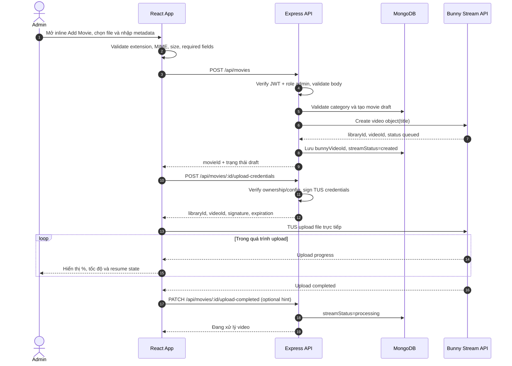

Quy tắc lỗi:

- Nếu tạo Bunny object thất bại, API trả lỗi và bản ghi local phải rollback hoặc chuyển `failed` có thể retry.
- Nếu upload gián đoạn, frontend dùng TUS fingerprint để resume; không tạo Bunny video mới.
- `upload-completed` chỉ là hint UX. Webhook/đối soát Bunny mới là nguồn xác nhận trạng thái.

## 3. Bunny encode và webhook cập nhật trạng thái

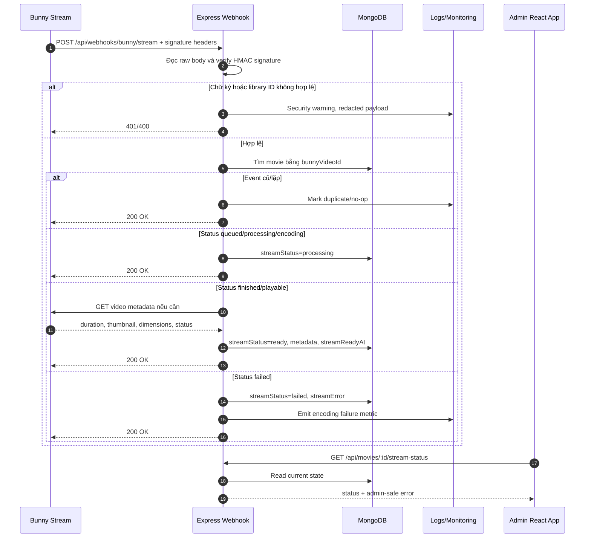

## 4. Admin import English subtitle

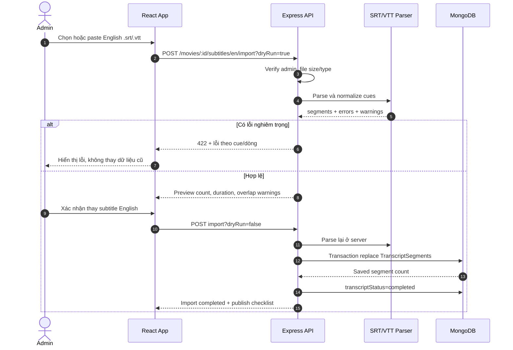

## 5. Admin import Vietnamese subtitle và matching

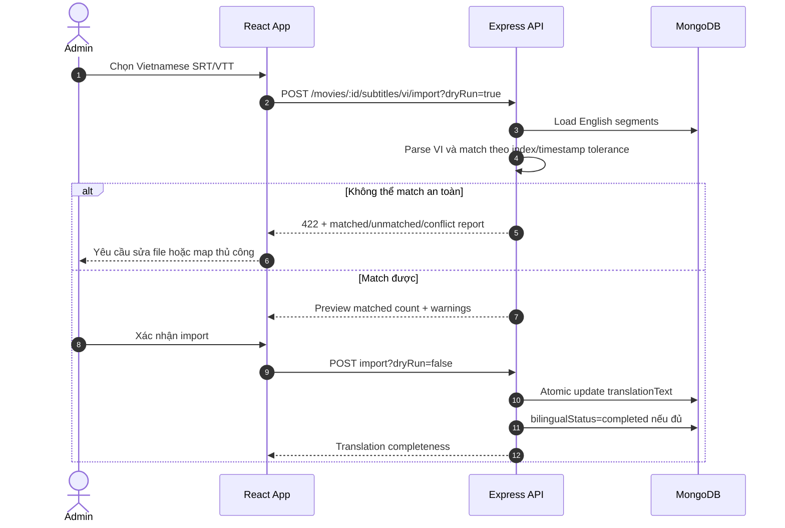

Không được match chỉ dựa vào số thứ tự mà bỏ qua timestamp; điều này có thể gắn sai bản dịch từ giữa phim nếu một file thiếu cue.

## 6. Admin tạo Vietsub tự động

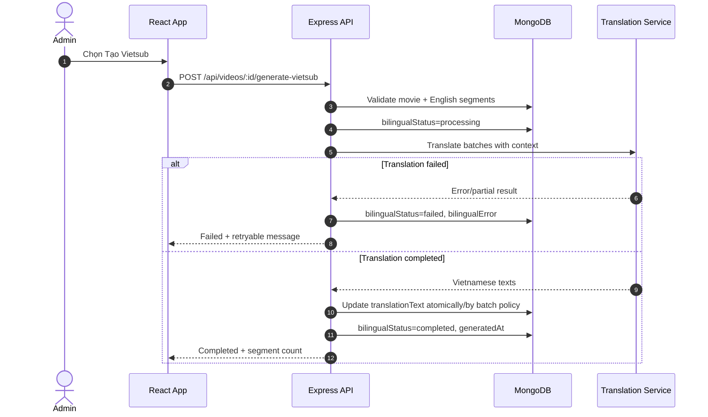

## 7. Admin preview và publish phim

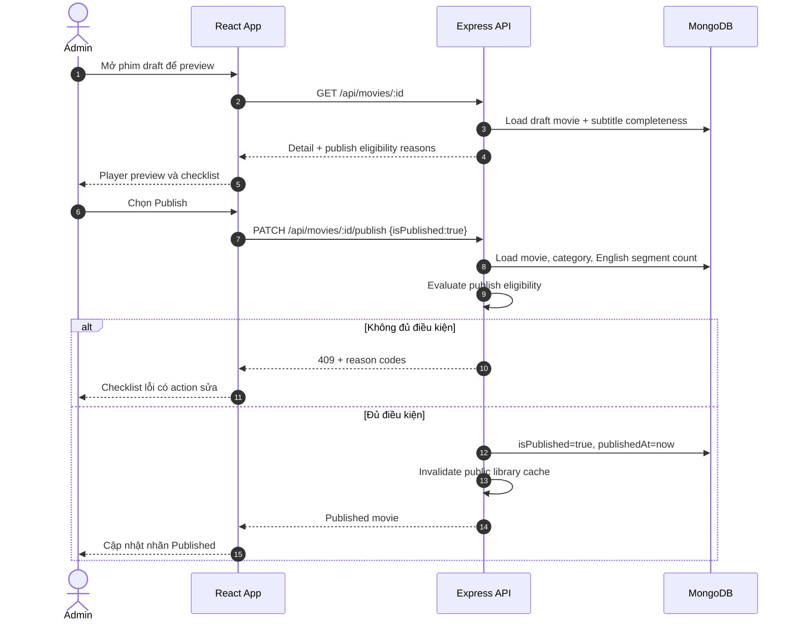

## 8. Public tải thư viện và quy tắc category rỗng

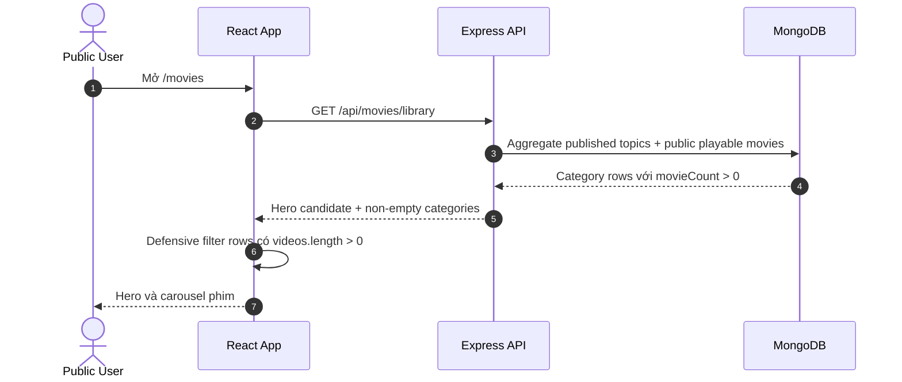

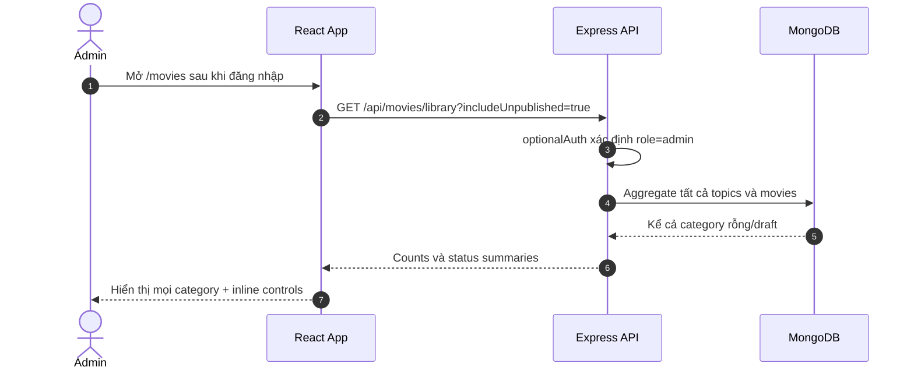

Nếu public cố gắn `includeUnpublished=true`, backend vẫn áp dụng public filter.

## 9. Public mở phim và nhận playback URL

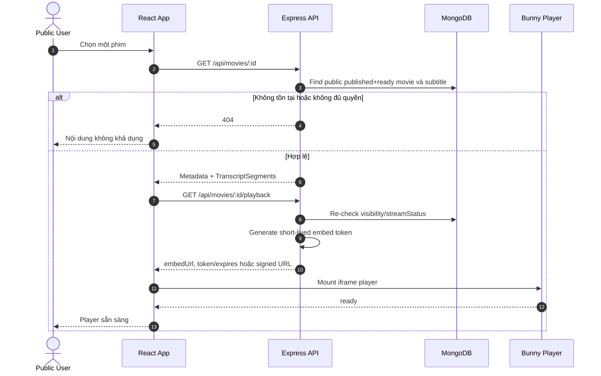

## 10. Đồng bộ player và phụ đề song ngữ

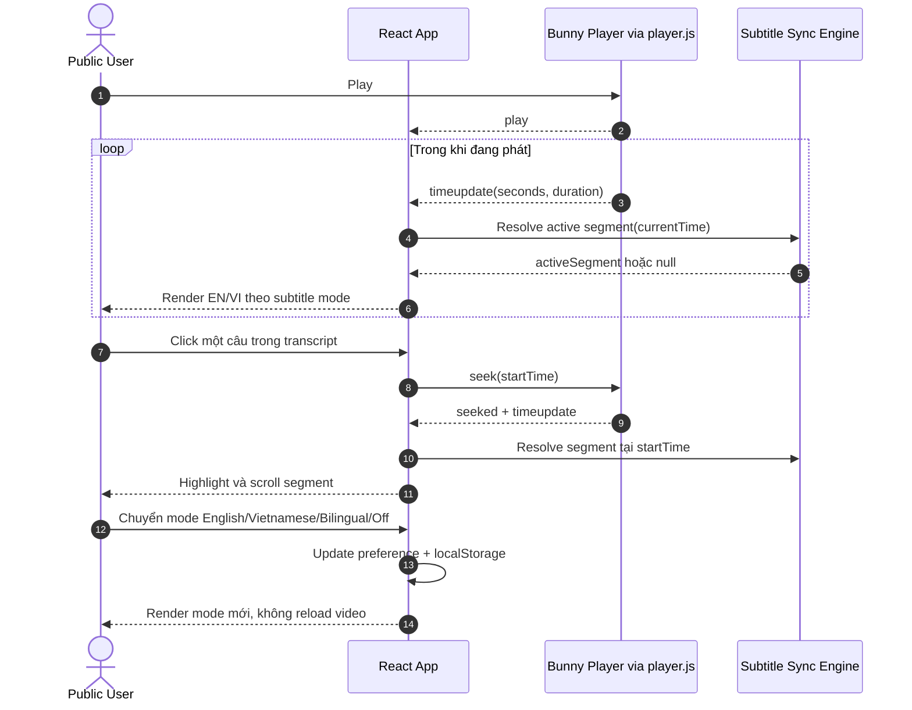

## 11. Unpublish và truy cập direct URL

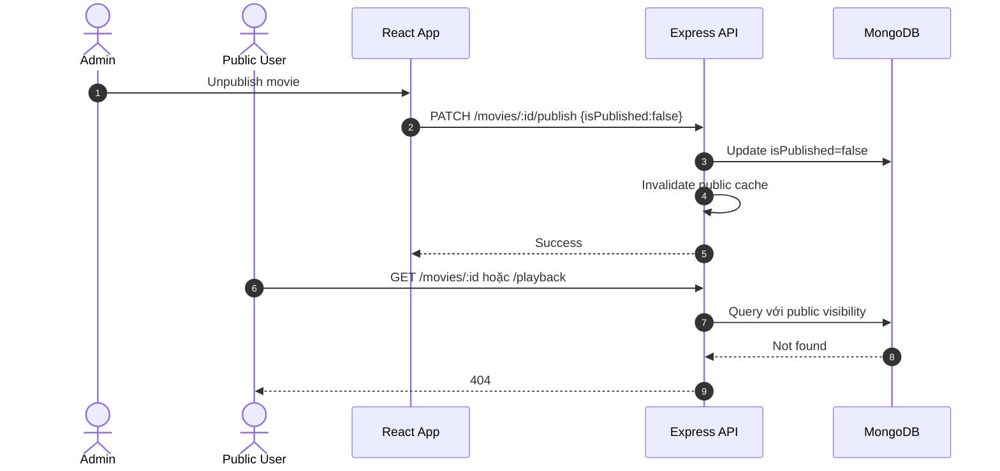

Token playback đã cấp có thể còn hiệu lực đến hết TTL. Vì vậy TTL cần ngắn; unpublish không được hiểu là thu hồi tức thời tuyệt đối nếu không có cơ chế token revocation ở CDN.

## 12. Xóa phim an toàn

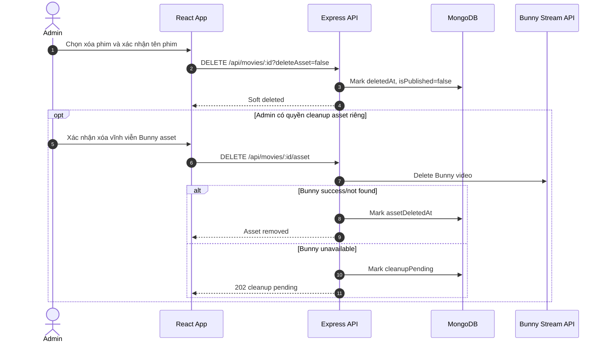

## 13. Correlation và audit

Mỗi luồng Admin/Bunny quan trọng cần có:

- `requestId` cho API request.
- `movieId`, `bunnyVideoId` và `adminUserId` trong structured log, không log secret.
- Audit event: `movie.created`, `upload.credentials_issued`, `stream.status_changed`, `subtitle.imported`, `movie.published`, `movie.unpublished`, `movie.deleted`.
- Webhook log có signature result, status cũ/mới và idempotency result.
