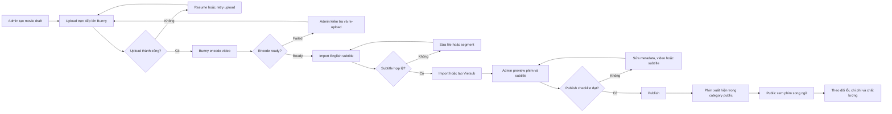
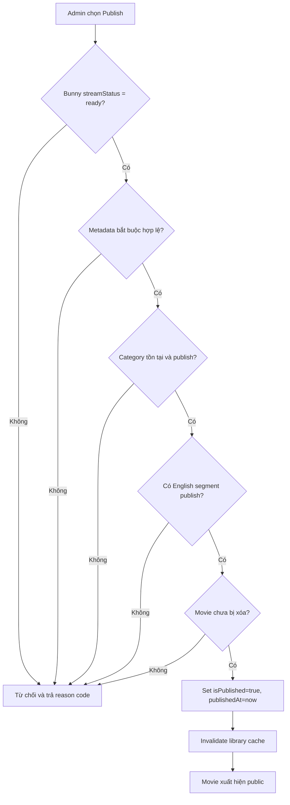
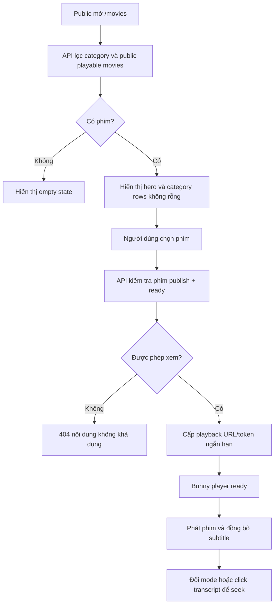
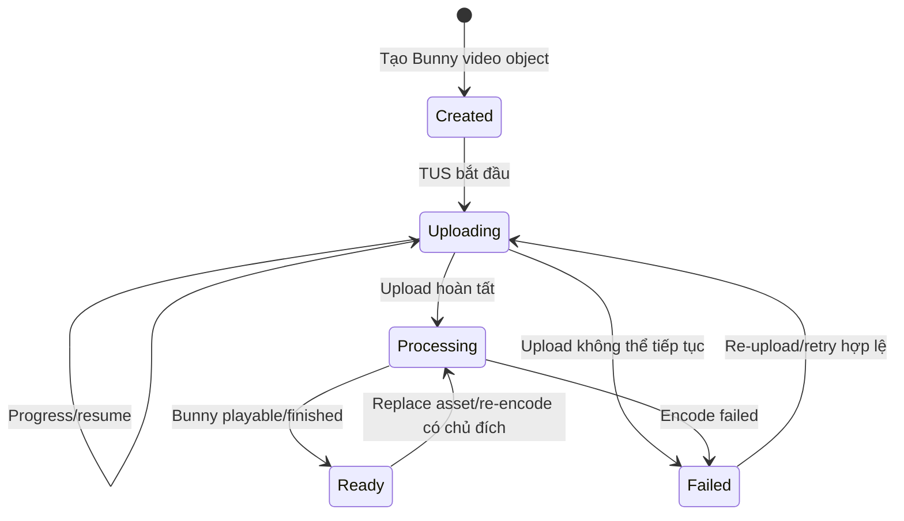
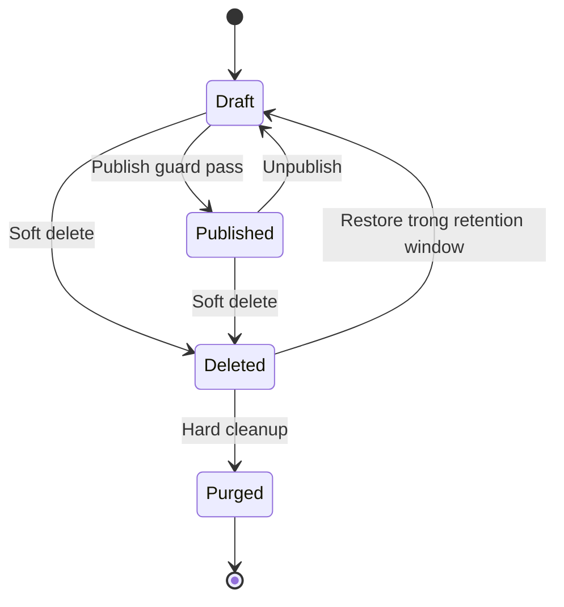
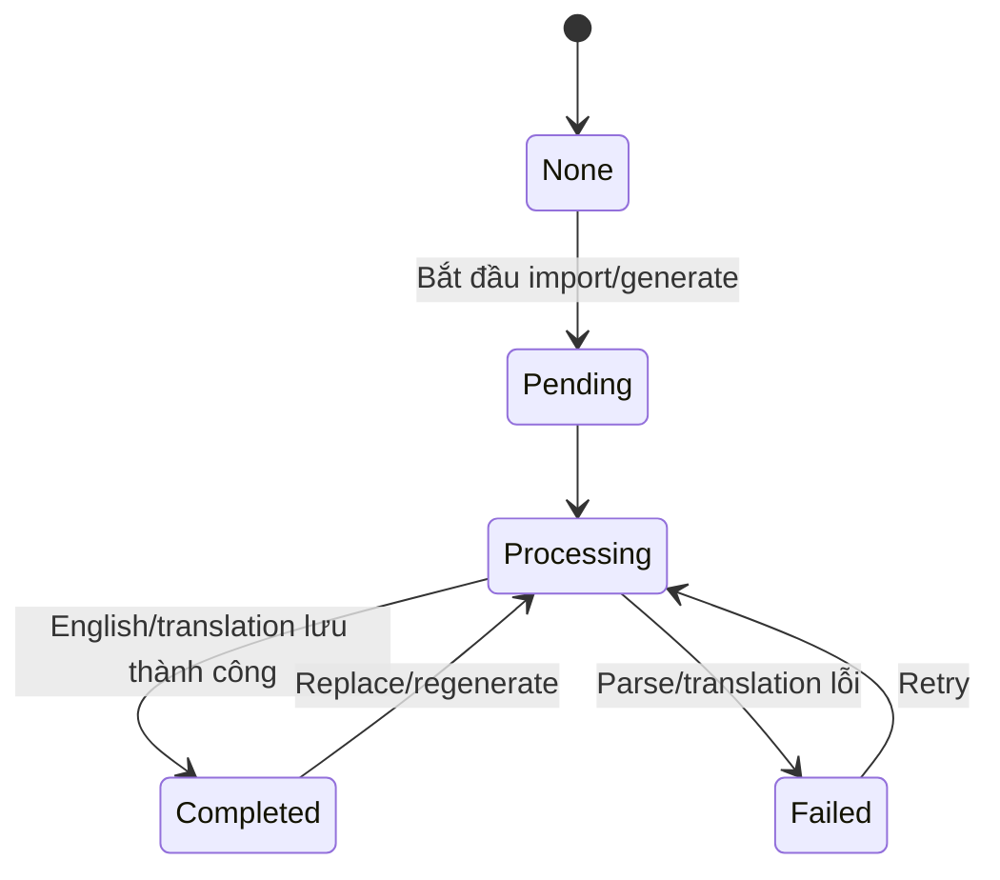
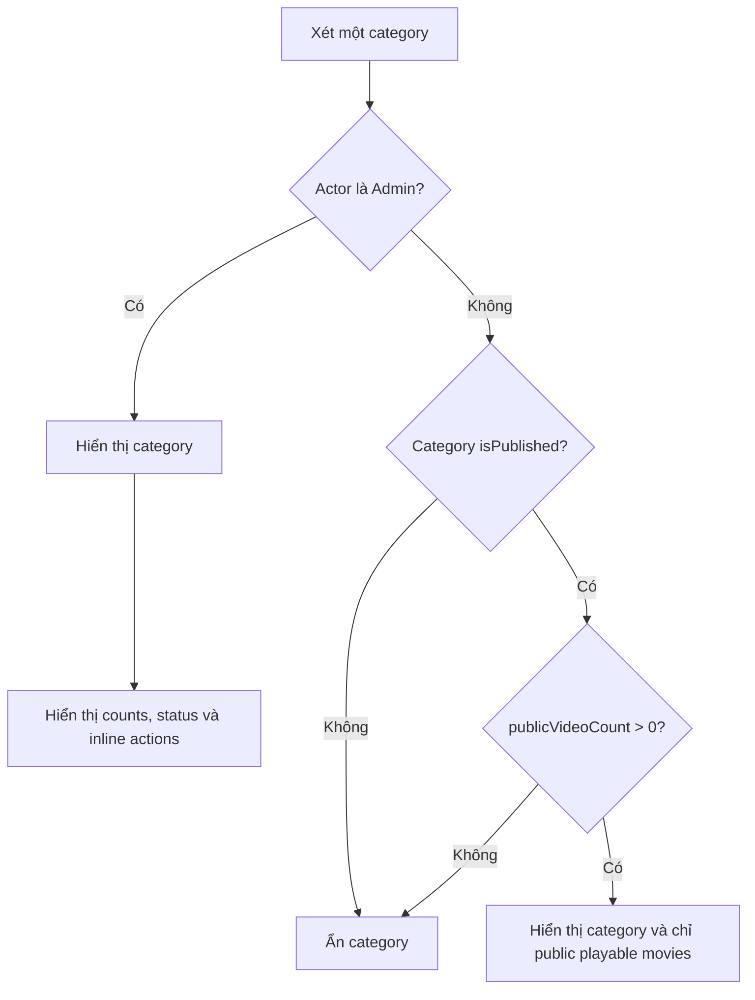

# Workflow - Vận hành tính năng xem phim song ngữ

## 1. Workflow tổng thể



## 2. Workflow Admin chi tiết

### Bước 1 - Chuẩn bị nội dung

Admin chuẩn bị:

- File video hợp pháp, ưu tiên MP4/H.264 + AAC để giảm rủi ro tương thích đầu vào.
- English subtitle `.srt` hoặc `.vtt` UTF-8.
- Vietnamese subtitle nếu đã có; nếu chưa có sẽ dùng generate Vietsub.
- Title, mô tả, category, level, release year.
- Poster tỷ lệ `2:3` và backdrop `16:9`, hoặc chấp nhận thumbnail fallback.

Điều kiện chuyển bước: file qua validation sơ bộ và category đã tồn tại.

### Bước 2 - Tạo draft và upload

1. Admin mở `/movies`.
2. Chọn icon/nút `Thêm phim` trong vùng inline admin.
3. Điền metadata và chọn file.
4. Hệ thống tạo draft local và Bunny video object.
5. Browser upload trực tiếp lên Bunny qua TUS.
6. UI hiển thị progress; Admin có thể rời/refresh và resume theo khả năng client.

Trạng thái mong đợi:

```text
draft + created -> uploading -> processing -> ready
                                  \-> failed
```

Admin không thể publish ở bước này, kể cả upload đã hoàn tất nhưng Bunny chưa ready.

### Bước 3 - Xử lý Bunny

1. Bunny gửi callback trạng thái.
2. Backend verify chữ ký và library ID.
3. Backend cập nhật trạng thái idempotent.
4. Khi ready, backend lưu duration/thumbnail cần thiết.
5. Admin UI polling nhẹ hoặc refetch để nhận trạng thái mới.

Nếu quá thời gian SLA encode dự kiến:

- Admin chọn `Đồng bộ trạng thái`.
- Backend query Bunny API.
- Nếu Bunny ready nhưng DB chưa cập nhật, hệ thống reconcile.
- Nếu Bunny failed, Admin re-upload vào asset mới theo flow có kiểm soát.

### Bước 4 - Import English subtitle

1. Admin mở workspace subtitle trên trang detail.
2. Chọn/paste `.srt` hoặc `.vtt`.
3. Hệ thống dry-run parse và hiển thị preview.
4. Admin xử lý error/warning.
5. Admin xác nhận replace.
6. Hệ thống lưu atomically vào `TranscriptSegment`.
7. Admin click một số cue đầu/giữa/cuối để kiểm tra seek.

Quality gate English:

- Có ít nhất một cue.
- Không có timestamp âm hoặc `end <= start`.
- Segment nằm trong duration phim với tolerance cấu hình.
- Text không rỗng.
- Không có overlap nghiêm trọng vượt threshold.

### Bước 5 - Bổ sung Vietsub

Nhánh A, có file Việt:

1. Import file.
2. Hệ thống match English/Vietnamese theo timestamp và index.
3. Admin review unmatched/conflict report.
4. Chỉ ghi khi mapping được xác nhận.

Nhánh B, chưa có file Việt:

1. Chọn `Tạo Vietsub`.
2. Hệ thống dịch theo batch.
3. Admin review các câu dài, thành ngữ, tên riêng và ngữ cảnh.
4. Admin sửa trực tiếp `translationText`.

Quality gate song ngữ:

- Không có mapping shift hàng loạt.
- Số segment đã dịch và còn thiếu hiển thị rõ.
- Không overwrite chỉnh sửa thủ công bởi job dịch cũ.

### Bước 6 - Preview

Admin kiểm tra ít nhất:

- Video phát được từ đầu, giữa và gần cuối.
- Audio/video đồng bộ.
- English cue đúng thời gian.
- Vietnamese text đúng câu và dễ đọc.
- Ba mode English, Vietnamese, Song ngữ và Off hoạt động.
- Click transcript seek đúng.
- Poster/backdrop/title/category đúng.
- Desktop và mobile không che controls.

### Bước 7 - Publish

UI hiển thị checklist, nhưng backend đánh giá lại toàn bộ điều kiện khi nhận request.



## 3. Workflow Public



Public không bao giờ được dùng dữ liệu `includeUnpublished` do query string để thay đổi policy backend.

## 4. State machine của phim

### 4.1 Stream status



Không có API generic nào cho Admin tự đặt `Ready`; chỉ Bunny webhook hoặc reconciliation service được phép chuyển trạng thái này.

### 4.2 Publication status



`Published` độc lập với `streamStatus`, nhưng mọi public query luôn yêu cầu cả `Published` và `Ready`.

### 4.3 Subtitle status



## 5. Workflow category và visibility

### 5.1 Định nghĩa count

- `totalVideoCount`: mọi movie record chưa bị soft delete trong category, Admin-only.
- `publicVideoCount`: phim thỏa tất cả điều kiện public playable.
- `draftCount`: phim chưa publish.
- `processingCount`: phim có stream status chưa ready.
- `failedCount`: phim stream/subtitle có lỗi cần Admin xử lý.

### 5.2 Quyết định hiển thị



Các tình huống cần regression test:

| Thay đổi | Kết quả public | Kết quả Admin |
| --- | --- | --- |
| Tạo category mới, chưa có phim | Ẩn | Hiện |
| Thêm phim draft vào category | Ẩn | Hiện + draft count |
| Phim ready nhưng chưa publish | Ẩn | Hiện |
| Publish phim đầu tiên | Category xuất hiện | Hiện |
| Unpublish phim public cuối cùng | Category biến mất | Vẫn hiện |
| Category chuyển draft | Category và phim biến mất | Vẫn hiện nhãn Draft |
| Bunny chuyển failed sau sự cố | Phim/category được loại khỏi public query | Hiện cảnh báo |

## 6. Workflow subtitle synchronization runtime

```mermaid
flowchart LR
    A["Bunny timeupdate"] --> B["Lấy currentTime"]
    B --> C{"Đang seek hoặc nhảy xa?"}
    C -- "Có" --> D["Binary search active segment"]
    C -- "Không" --> E["Tiến con trỏ segment hiện tại"]
    D --> F{"Có active segment?"}
    E --> F
    F -- "Không" --> G["Ẩn overlay"]
    F -- "Có" --> H{"Subtitle mode"]
    H -- "Bilingual" --> I["Render EN + VI"]
    H -- "English" --> J["Render EN"]
    H -- "Vietnamese" --> K["Render VI"]
    H -- "Off" --> G
    I --> L["Highlight transcript row"]
    J --> L
    K --> L
```

Quy tắc runtime:

- Không set React state nếu active segment không đổi.
- Không auto-scroll transcript nếu người dùng vừa chủ động scroll; resume sau khoảng chờ.
- Không render dòng Việt rỗng.
- Overlay dùng `pointer-events: none` trừ control riêng, tránh chặn player controls.
- Khi click transcript, command seek đi qua player adapter, không thao tác iframe DOM trực tiếp.

## 7. Workflow lỗi và phục hồi

### Upload lỗi

1. Giữ `movieId`, `bunnyVideoId`, upload fingerprint và progress có thể phục hồi.
2. Phân biệt lỗi mạng, credential hết hạn, file bị đổi và Bunny 4xx/5xx.
3. Xin credential mới khi hết hạn nhưng tiếp tục cùng video nếu Bunny cho phép.
4. Chỉ tạo asset mới khi asset cũ không thể tiếp tục, có cleanup marker cho asset cũ.

### Webhook lỗi

1. Signature sai: reject, log security event, không retry nội bộ.
2. DB tạm lỗi: trả non-2xx để Bunny retry nếu policy hỗ trợ.
3. Callback lặp: trả 200 no-op.
4. Không nhận callback: manual/scheduled reconciliation.

### Subtitle lỗi

1. Dry-run trả lỗi theo dòng/cue.
2. Dữ liệu cũ giữ nguyên.
3. Admin tải report hoặc sửa file.
4. Import lại và preview trước confirm.

### Playback lỗi

1. Nếu token hết hạn trước mount, refresh token một lần.
2. Nếu player error lặp, hiển thị retry + correlation code.
3. Không fallback sang URL original công khai nếu security policy không cho phép.

## 8. Workflow unpublish và xóa

### Unpublish

- Chuyển `isPublished=false`.
- Invalidate library/detail cache.
- Public request mới nhận 404.
- Playback token cũ có thể sống đến TTL, nên TTL phải ngắn.
- Admin vẫn preview nếu stream ready.

### Soft delete

- Chuyển `deletedAt=now`, `isPublished=false`.
- Không xóa Bunny asset hoặc transcript ngay.
- Cho restore trong retention window.
- Không tính record deleted trong category counts thông thường.

### Hard cleanup

- Là action riêng, xác nhận mạnh.
- Gọi Bunny delete trước hoặc dùng outbox/cleanup job để tránh trạng thái nửa chừng.
- Nếu Bunny lỗi, đánh dấu `cleanupPending` và retry.
- Chỉ purge DB/transcript sau khi asset state đã được đối soát theo policy.

## 9. Workflow release vận hành

```mermaid
flowchart LR
    A["Develop"] --> B["Automated tests"]
    B --> C["Deploy staging"]
    C --> D["Upload phim test thực tế"]
    D --> E["UAT public/admin/mobile"]
    E --> F{"Pass?"}
    F -- "Không" --> A
    F -- "Có" --> G["Run migration production"]
    G --> H["Enable Admin-only feature flag"]
    H --> I["Smoke test upload/playback"]
    I --> J["Canary public"]
    J --> K["Full rollout"]
    K --> L["Monitor 24-48h"]
```



### Monitoring bắt buộc

- Upload create/complete/fail rate.
- Encode ready/failed và thời gian processing.
- Webhook signature failures, duplicates và processing latency.
- Playback token API error/p95.
- Player ready time và playback error rate nếu telemetry cho phép.
- Subtitle import error rate và translation completeness.
- Storage/bandwidth cost theo tuần/tháng.
- Số category public/admin và kiểm tra invariant category public rỗng bằng 0.

## 10. Runbook sự cố rút gọn

### Phim published nhưng không phát

1. Unpublish nếu lỗi ảnh hưởng public nghiêm trọng.
2. Kiểm tra DB `streamStatus`, Bunny dashboard và playback token log.
3. Đối soát domain/referrer/token expiry.
4. Reconcile metadata/status.
5. Publish lại sau smoke test.

### Category rỗng xuất hiện public

1. Kiểm tra public API response và cache.
2. Xác nhận aggregation dùng `public playable`, không dùng total count.
3. Invalidate cache.
4. Bật frontend defensive filter nếu chưa có.
5. Thêm regression test cho trạng thái gây lỗi.

### Subtitle lệch toàn phim

1. Unpublish hoặc tắt nhãn song ngữ nếu ảnh hưởng lớn.
2. Xác định lệch cố định hay drift tăng dần.
3. Khôi phục subtitle version trước nếu có.
4. Import file đã chỉnh và preview đầu/giữa/cuối.
5. Publish lại sau UAT.

## 11. Checklist vận hành mỗi phim

- [ ] File có quyền sử dụng và đúng format.
- [ ] Bunny upload hoàn tất, `streamStatus=ready`.
- [ ] Duration/thumbnail/poster/backdrop hợp lệ.
- [ ] Category và metadata chính xác.
- [ ] English subtitle import pass.
- [ ] Vietsub đủ hoặc nhãn completeness phản ánh đúng.
- [ ] Preview đầu/giữa/cuối trên desktop.
- [ ] Preview mobile và kiểm tra controls/subtitle overlap.
- [ ] Publish checklist backend pass.
- [ ] Sau publish, public library/detail/playback smoke test pass.
